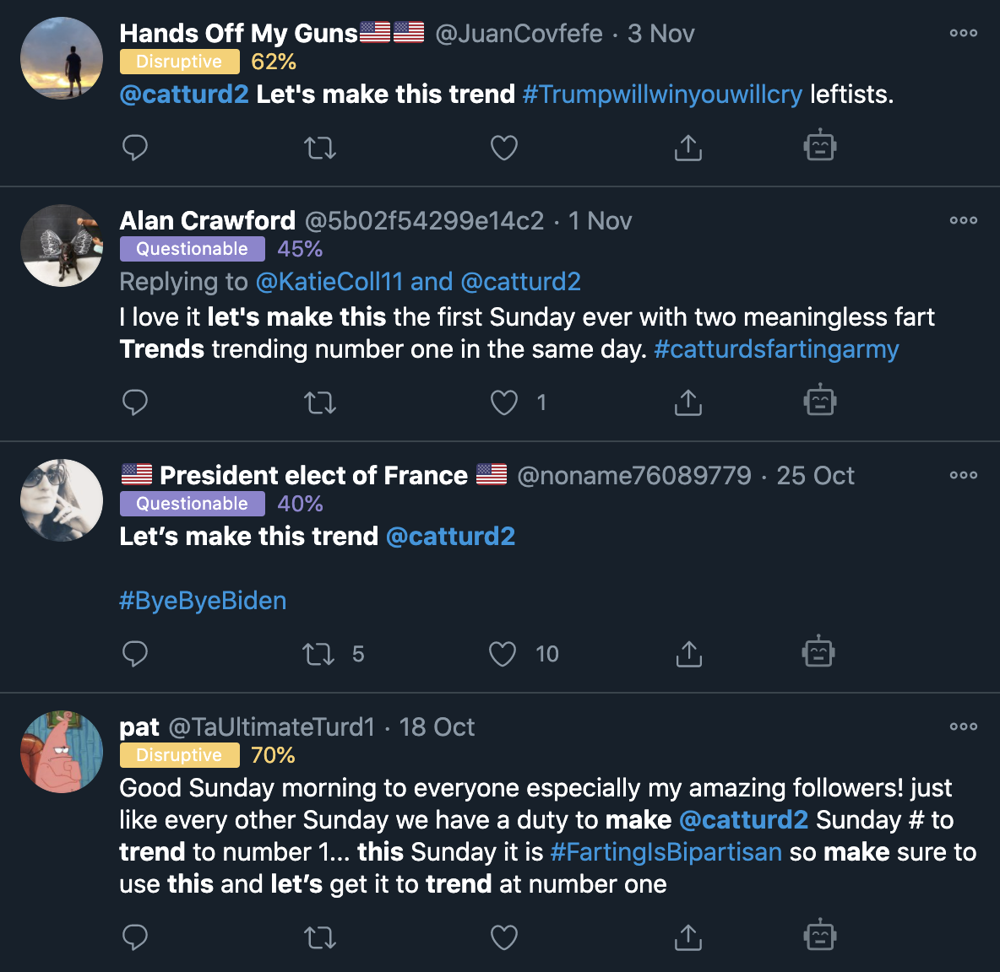
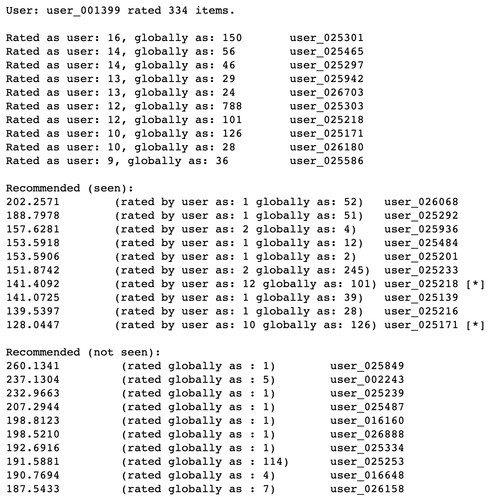
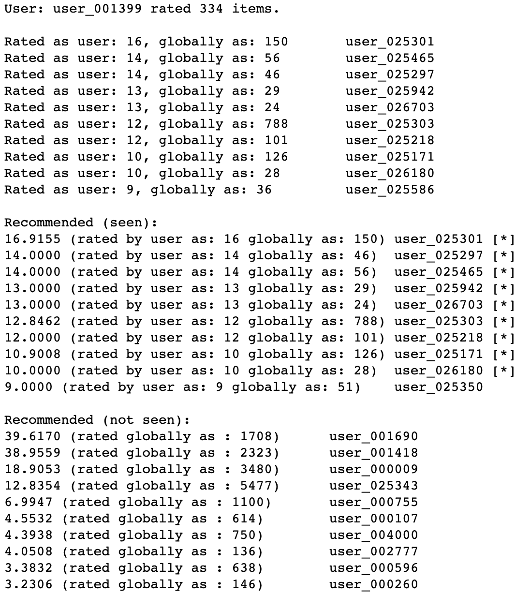
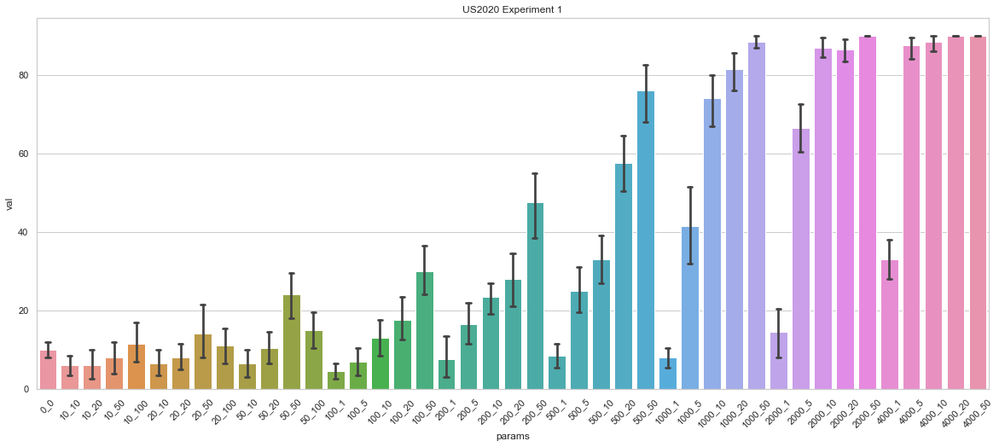
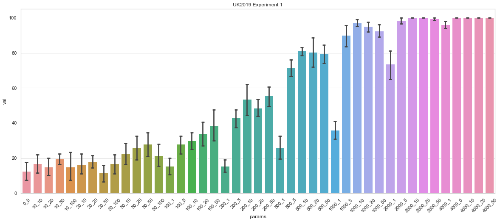
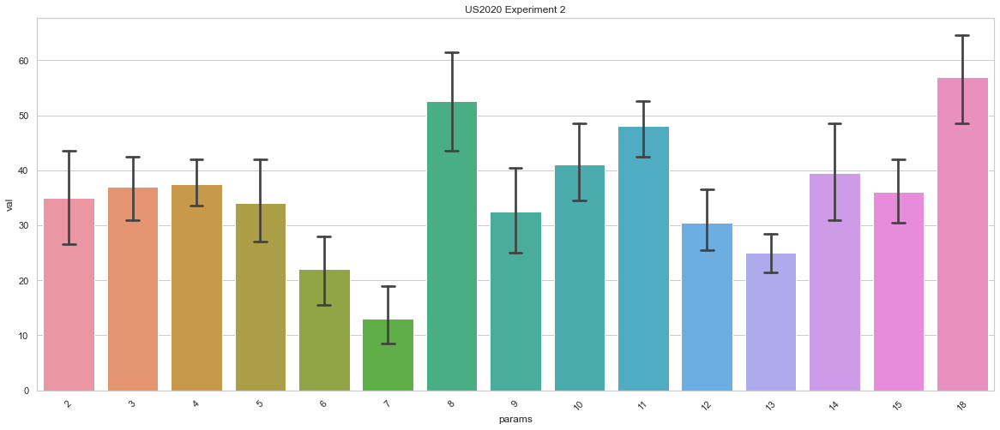
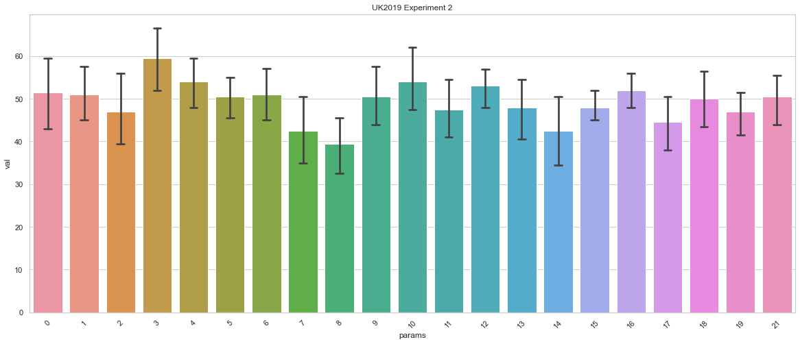

# Simulating poisoning attacks against collaborative filtering-based recommendation mechanisms
This repository details a number of experiments designed to simulate attacks against social network recomendation mechanisms, and evaluate their effectiveness.

# Introduction
Social networks employ a variety of mechanisms designed to recommend content and actions to users. These mechanisms are designed to suggest other users to follow (Twitter), suggest groups to join (Facebook), construct curated timelines and search results (Twitter), and recommend videos to watch (YouTube). It is highly likely that some of these mechanisms utilize collaborative filtering techniques. Collaborative filtering is a machine learning technique that calculates similarities between users and items based on recorded user preference data. Similarity vectors contained in a trained collaborative filtering model can then be used to output recommendations for any user in the system. Recommendations are typically based on one of two criteria:
- user-based recommendations recommend items that were popular with similar users
- item-based recommendations recommend items that are similar to other items the user has interacted with

Knowledge of how these mechanisms work can be used to craft attacks against recommender systems. A number of motives exist for such attacks:
- promotion attacks: 
  - cause a piece of content, item, or user to be ranked similar to another piece of content, item, or user in the system.
  - cause a piece of content, item, or user to appear at a higher position in a user's timeline or in search results.
- demotion attacks:
  - cause a piece of content, item, or user to be ranked less similar to another piece of content, item, or user in the system.
  - cause a piece of content, item, or user to appear at a lower position (or not at all) in a user's timeline or in search results.
- social engineering: if an adversary already has knowledge on how a specific user has interacted with items in the system, an attack can be crafted to target that user with a recommendation.

The most widely used attacks against recommender mechanisms are Sybil attacks. The attack process is straightforward – an adversary creates several fake users or accounts, and has them engage with items in patterns designed to change how that item is recommended to other users. Here, the term ‘engage’ is dependent on the system being attacked, and could include rating an item, reviewing a product, browsing a number of items, following a user, adding items to a shopping basket or wishlist, or liking a post. Attackers may probe the system using ‘throw-away’ accounts in order to understand underlying recommendation mechanisms, and to test whether any detection capabilities exist in the system. Skilled attackers carefully automate their fake users to behave like normal users in order to avoid Sybil attack detection techniques. Such approaches are facilitated by a plethora of inexpensive services available on the Internet. These services allow an attacker to purchase views, likes, retweets, followers, reviews, and ratings on all of the big-name social networks, crowdsourced review sites, app stores, and ecommerce sites. You can read more commentary on this phenomenon here https://blog.f-secure.com/how-ai-is-already-being-poisoned-against-you/.

A much more common poisoning approach involves a large number of users collectively agreeing to perform a specific action in order to achieve a goal (promote a piece of content, promote a user, cause a phrase, keyword, or hashtag to trend, etc.) Coordinated promotion attacks are extremely common on Twitter. Users form large groups using "followback" mechanisms:
- many accounts post tweets that contain lists of accounts to follow
- those tweets are retweeted by hundreds or thousands of other participating accounts
- when a user follows one of the mentioned accounts, that account will follow them back


The mechanism results in large groups of accounts that follow each other. It is not uncommon to find accounts on Twitter that follow and are followed by tens of thousands of other accounts. These followback rings, or retweet rooms, then collaborate to amplify content, keywords, phrases, or hashtags.




Twitter coordination is also used to boost brand new Twitter accounts. The process is documented here https://blog.f-secure.com/discovering-hidden-twitter-amplification/.

Due to the prevalence of coordinated Sybil attacks on social networking sites such as Twitter, a study of how these attacks shape underlying collaborative filtering models and recommendation mechanisms is of interest. The research documented here focuses on the study of those attacks. The experiments documented in this report attempt to manipulate recommendation algorithms by simulating Sybil attacks designed to boost an account such that it is recommended to users it otherwise wouldn’t have been recommended to. Experimental details follow.

# Experimental details

All experiments documented here follow the procedure outlined below:
1. Load a dataset of anonymized retweet interactions collected from actual Twitter data.
2. Train a collaborative filtering model on the loaded data.
3. Select a target account to be "amplified" such that it is recommended to a set of users who have interacted with a separate, high-profile user also in the dataset. We select 20 such users as a "control" set.
4. Implement simple recommendation logic based on cosine similarity of the vector representations of the trained model, and observe recommendations for the control set.
5. Select a set of "amplifier accounts" that have not interacted with either the target account or the high-profile account.
6. For a number of different proposed sets of amplifier accounts and parameter choices, create a new dataset containing additional interactions between each selected amplifier account and both the target account and the high-profile account. In practise, this process involves appending two new rows per amplifier account - one adding a retweet count for the target account and another adding retweet count for the high-profile account.
7. Train a new model on the modified dataset.
8. Run both target-based and source-based recommendations for each member of the control group and record the number of times the target appeared in the top-n (3) recommendations.
9. Present and discuss the results.

In all cases, experiments were run for 10 iterations in order to obtain an average value and corresponding error bars.

For each dataset, the following experiments were run:
1. Amplifier accounts were selected at random from the entire dataset. Different numbers of amplifiers and retweet counts were tried. This experiment was run to determine lower bounds for effective algorithmic manipulation, and a study of the effects of large-scale manipulation at higher values.
2. Amplifiers accounts were chosen from communities derived from applying the Louvian community detection algorithm across a node-edge graph of the original dataset. For each community with at least 200 members, the experiment was run with a fixed 200 amplifiers, each performing 20 retweets of both target account and high-profile account. This experiment was run to determine whether community membership contributes to the effectiveness of algorithmic manipulation.
3. A set of amplifiers with high cosine similarity to the members of the control set were selected. As in experiment 1, varying numbers of amplifiers and retweets were tested. This experiment was designed to determine whether similarity to the control set contributes to the effectiveness of algorithmic manipulation.

If you're interested in the details of these implementations, take a look at the accompanying jupyter notebooks.

## About the datasets
This repository contains two datasets that represent anonymized retweet interactions between Twitter accounts. All data was captured directly from Twitter. The two datasets are described in more detail below.

### US2020
This dataset was collected using the filter function of Twitter's streaming API (https://developer.twitter.com/en/docs/twitter-api/v1/tweets/filter-realtime/api-reference/post-statuses-filter). The filter API was instructed to capture Tweet objects from approximately 100 accounts participating in US political discussion during mid-October 2020. Twitter's filter API returns Tweet objects when any of the queried accounts publish a tweet, and when tweets mentioning (replies, retweets, mentions) any of the queried accounts are published.

This dataset contains 52920 rows representing interactions between 25137 retweeters and 8405 retweeted across a total of 95893 retweet interactions. Some additional statistics about the dataset can be viewed by running the accompanying notebook.

- **user_025303** was chosen as the high-profile account. This verified Twitter account belongs to a US politician and receives a great deal of engagement on the platform.
- **user_004286** was chosen as the target account. This non-verified Twitter account actively participates in US political conversation, and often shares disinformation.

The following image is a graph visualization of this dataset.


### UK2019
This dataset was collected using the filter function of Twitter's streaming API (https://developer.twitter.com/en/docs/twitter-api/v1/tweets/filter-realtime/api-reference/post-statuses-filter). The filter API was instructed to capture Tweet objects matching a small number of hashtags related to the December 12th 2019 UK general election. Hashtags included #GE2019, #GE19, #generalelection2019 and #generalelection19.

This dataset contains 112963 rows representing interactions between 35007 retweeters and 3057 retweeted across a total of 123890 retweet interactions. Some additional statistics about the dataset are generated in the accompanying notebook.

- **user_035060** was chosen as the high-profile account. This verified Twitter account belongs to a popular activist that receives engagement from left-wing users on the platform.
- **user_035067** was chosen as the target account. This non-verified Twitter account is a noteable proponent of Brexit, an avid supporter of the UK Conservative party, and often shares biased content and disinformation.

The following image is a graph visualization of this dataset.


In both cases, once raw Twitter data had been collected, retweet interactions between accounts were processed from Tweet objects in the form:

**account_retweeting** - **account_being_retweeted** - **number_of_retweets_observed**. 

Account names were anonymized by replacing the Twitter user's screen_name with an anonymized name in the form **user_XXXXXX**. This data was then written to disk as a csv in the form Source,Target,Weight - allowing it to be read into Pandas dataframes and directly imported into gephi (https://gephi.org) for graph visualization purposes. Both datasets can be found in this repository under UK2019/anonymized_interactions.csv and US2020/anonymized_interactions.csv. 

## Recommendation algorithm implementations
The fastai collaborative filtering model consists of a set of learned weights for both sources and targets. A cosine similarity matrix can be built from each of these sets of vectors, thus allowing one to query the similarity between any given pair of sources or targets. Using these cosine similarity matrices, one can implement the following simple recommendation algorithms that can be used to reccommend accounts to a user based on who the user has retweeted.

### Target-based similarity
Using the target-based cosine similarity matrix, recommendations can be calculated for a source based on who they've retweeted. For a given source, obtain a list of all target accounts they've retweeted and the number of times the source retweeted that account. For each of the target accounts identified, obtain a list of _t_max_matches_ most similar accounts from the (previously calculated) target-based cosine similarity matrix. For each of these, multiply the similarity value (between the source account and the target account) with the number of times the source retweeted the target account, and add that value to a running total score for each target retweeted account.

In pseudocode:
```
for target, num_retweets in get_source_retweets(source):
    for similar, similarity in get_most_similar(target):
        recommended[similar] += num_retweets * similarity
```

### Source-based similarity
Using the source-based cosine similarity matrix, a ranked list of recommendations can be generated for a given source account as follows. First obtain a list of _s_max_matches_ accounts most similar to the source account. For each of these accounts, obtain a list of target accounts they retweeted, and the number of times they retweeted. For each target-retweeted_count pair, multiply retweeted_count by the similarity value between the source and this account. Add that value to a running total score for each target retweeted account.

In pseudocode:
```
for similar_source, similarity in get_most_similar(source):
    for target, num_retweets in get_source_retweets(similar_source):
        recommended[target] += similarity * num_retweets
```

Both of the above mechanisms will generate a ranked list of target accounts to recommend to the source - a list of targets and score values where higher scores are more highly recommended. By comparing this ranked list to a list of accounts the source has already interacted with, a list of recommendations of targets the user hasn't yet interacted with can be generated.

Note we can measure the effectiveness of both of these methods by comparing the ranked list of recommended accounts against accounts the user has already retweeted. The closer the lists match, the more accurate the recommendations are.

Here is a sample output for the target-based recommendation algorithm. Note that only two of the calculated recommendations matched accounts the source had already interacted with.



Here is a sample output for the source-based recommendation algorithm, based on the same user shown in the previous example. Here we note that nine of the calculated recommendations matched accounts the source had already interacted with.



Based on experimental results it is apparent that source-based recommendations are much more accurate.

Note that the recommendation algorithms implemented in these experiments are intentionally simple. Social network recommendation methodology is likely based on similar principles (i.e. collaborative filtering, plus some additional logic), but may utilize other available information such as:
- which accounts the user is following or being followed by
- metrics related to content a user viewed and how long they viewed that content for
- hashtags the user has included in their posts
- accounts the user has tagged in their posts
- accounts the user has replied to
- likes (which are not available via the Twitter API)
- the user's geographical region
- the user's language settings
- and so on.

Note that it would be extremely difficult to determine how close the algorithms implemented in this experiment match the underlying mechanisms in real social networks such as Twitter. The data we're working with is fixed - it's a snapshot collected over a short period of time. The data also only includes interactions between a limited number of accounts. One may view this experiment as a series of "what-if" experiments, which demonstrate how recommendations in the system would have changed if retweet activity had been different to the originally recorded behaviour.


# Results and discussion

## Experiment 1: Randomly chosen amplifiers

The following bar charts depict the effect of varying numbers of amplifier accounts and retweet counts on both the US2020 and UK2019 datasets. Each bar represents the mean percentage of control accounts that were recommended the target account in the top-3 source-based recomendations over 10 runs. Error bars indicate the minimum and maximum values across those ten runs.

**NOTE** these experiments had no effect on the target-based recommendation algorithm. All bar charts associated with those experiments are empty, and thus are not shown. This is the case across all of the conducted experiments.




Upon inspection, it is clear that the experimental methodology was more effective at manipulating recommendations for the UK2019 dataset. This is noticeable at lower values (200 amplifiers with 50 retweets were required to obtain 50% coverage in the US2020 dataset versus 200 amplifiers and 10 retweets for the UK2019 dataset). At higher values, we observe that 1000 amplifiers with 1 retweet and 2000 amplifiers with 1 retweet were much more impactful on the recommendations of the UK2019 models. 

It is interesting to note what happens to graph visualizations of these networks as we add edges. Here's the baseline UK2019 dataset with the target and high-profile accounts highlighted. Note the separation between the two accounts of interest.


Here's the same graph, but with 500 amplifiers, 1 retweet each. Note how the nodes of interest have moved closer together.


With 1000 amplifiers, 1 retweet each. Nodes move even closer.


Note how close together the two nodes of interest are when we use 200 amplifiers, 20 retweets each.


Since the US2020 dataset was created by following specific Twitter accounts, it is likely more similar to the sort of feed a user on that platform would see on their home timeline. By default, Twitter curates a user's home timeline, and thus if it were to use a retweet similarity algorithm similar to the one implemented in these experiments, it would be susceptible to such manipulation. Twitter has openly stated that they factor "Likes" into building timelines, so it may be possible that a similar mechanism using the "Like" button instead of the "Retweet" button may be effective at surfacing content on the control users' timelines in real life. This method may also be relevant if Twitter's recommendations for which accounts that user should follow were based on a similar mechanism (although that is not likely to be the case).

## Experiment 2: Amplifiers chosen based on community

The following bar charts depict experimental results from selecting amplifiers based on Louvian community detection applied to a node-edge graph of the baseline datasets, and using fixed 200 amplifiers with 20 retweets parameters.

Here's the bar chart for the US2020 dataset. Bear in mind that using randomly chosen amplifiers resulted in about 30% of the control set being recommended the target account.


Here's the bar chart for the UK2019 dataset. Bear in mind that using randomly chosen amplifiers resulted in about 50% of the control set being recommended the target account.



# Conclusions

# Appendix


## Libraries used

- Numpy (https://numpy.org/)
- Pandas (https://pandas.pydata.org/)
- NetworkX (https://networkx.org/)
- Louvian community detection (https://github.com/taynaud/python-louvain)
- Collaborative filtering model: fastai collab_learner (https://docs.fast.ai/collab)
- Cosine similarity matrix: sklearn cosine_similarity (https://scikit-learn.org/stable/modules/generated/sklearn.metrics.pairwise.cosine_similarity.html)
- Visualizsation: matplotlib (https://matplotlib.org/) and seaborn (https://seaborn.pydata.org/)
