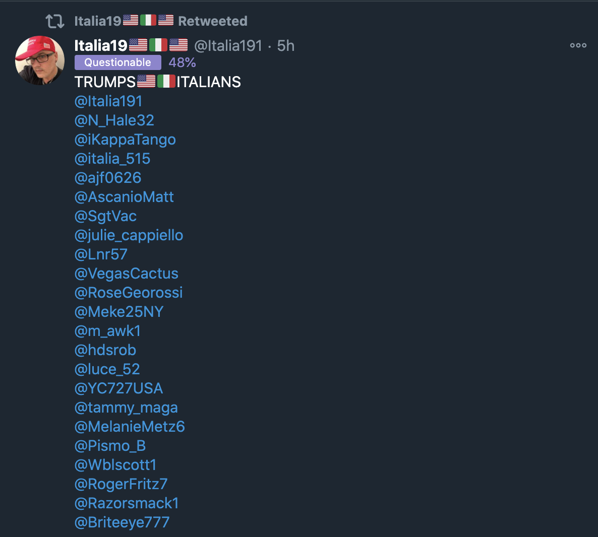

# Simulating poisoning attacks against collaborative filtering-based recommendation mechanisms
This repository details a number of experiments designed to simulate attacks against social network recomendation mechanisms, and evaluate their effectiveness.

# Introduction
Social networks employ a variety of mechanisms designed to recommend content and actions to users. These mechanisms are designed to suggest other users to follow (Twitter), suggest groups to join (Facebook), construct curated timelines and search results (Twitter), and recommend videos to watch (YouTube). It is highly likely that some of these mechanisms utilize collaborative filtering techniques. Collaborative filtering is a machine learning technique that calculates similarities between users and items based on recorded user preference data. Similarity vectors contained in a trained collaborative filtering model can then be used to output recommendations for any user in the system. Recommendations are typically based on one of two criteria:
- user-based recommendations recommend items that were popular with similar users
- item-based recommendations recommend items that are similar to other items the user has interacted with

Knowledge of how these mechanisms work can be used to craft attacks against recommender systems. A number of motives exist for such attacks:
- promotion attacks: 
  - cause a piece of content, item, or user to be ranked similar to another piece of content, item, or user in the system.
  - cause a piece of content, item, or user to appear at a higher position in a user's timeline or in search results.
- demotion attacks:
  - cause a piece of content, item, or user to be ranked less similar to another piece of content, item, or user in the system.
  - cause a piece of content, item, or user to appear at a lower position (or not at all) in a user's timeline or in search results.
- social engineering: if an adversary already has knowledge on how a specific user has interacted with items in the system, an attack can be crafted to target that user with a recommendation.

The most widely used attacks against recommender mechanisms are Sybil attacks. The attack process is straightforward – an adversary creates several fake users or accounts, and has them engage with items in patterns designed to change how that item is recommended to other users. Here, the term ‘engage’ is dependent on the system being attacked, and could include rating an item, reviewing a product, browsing a number of items, following a user, adding items to a shopping basket or wishlist, or liking a post. Attackers may probe the system using ‘throw-away’ accounts in order to understand underlying recommendation mechanisms, and to test whether any detection capabilities exist in the system. Skilled attackers carefully automate their fake users to behave like normal users in order to avoid Sybil attack detection techniques. Such approaches are facilitated by a plethora of inexpensive services available on the Internet. These services allow an attacker to purchase views, likes, retweets, followers, reviews, and ratings on all of the big-name social networks, crowdsourced review sites, app stores, and ecommerce sites. You can read more commentary on this phenomenon here https://blog.f-secure.com/how-ai-is-already-being-poisoned-against-you/.

A much more common poisoning approach involves a large number of users collectively agreeing to perform a specific action in order to achieve a goal (promote a piece of content, promote a user, cause a phrase, keyword, or hashtag to trend, etc.) Coordinated promotion attacks are extremely common on Twitter. Users form large groups using "followback" mechanisms:
- many accounts post tweets that contain lists of accounts to follow
- those tweets are retweeted by hundreds or thousands of other participating accounts
- when a user follows one of the mentioned accounts, that account will follow them back




The mechanism results in large groups of accounts that follow each other. It is not uncommon to find accounts on Twitter that follow and are followed by tens of thousands of other accounts. These followback rings, or retweet rooms, then collaborate to amplify content, keywords, phrases, or hashtags.

Twitter coordination is also used to boost brand new Twitter accounts. The process is documented here https://blog.f-secure.com/discovering-hidden-twitter-amplification/.


## AIM
Simulate social network recommendation logic and attempt to manipulate it using poisoning attacks.

## GOAL
Use a Sybil attack to boost an account such that it is recommended to users it otherwise wouldn’t have been recommended to.


# Experimental detail


The attacks detailed in this report are designed to boost a specifically chosen target user such that it is recommended to users who interacted with a separate, specific high-profile user. Each attack is performed by instructing a number of accounts to retweet both the target account (to be boosted) and the separate high-profile user. This experiment demonstrates the effectiveness of this attack using different numbers of attacker accounts and retweet counts.

## Experimental process

This experimental procedure follows these steps:
1. Load a dataset of anonymized retweet interactions collected from actual Twitter data.
2. Train a collaborative filtering model on the loaded data.
3. Select a target account to be "amplified" such that it is recommended to a set of users who have interacted with a separate, high-profile user also in the dataset. We select 20 such users as a "control" set.
4. Implement simple recommendation logic based on cosine similarity of the vector representations of the trained model, and observe recommendations for the control set.
5. Select a set of "amplifiers" that have not interacted with either the target account or the high-profile account.
6. For various numbers of amplifier accounts and retweet counts, create a new dataset containing additional interactions between each selected amplifier account and both the target account and the high-profile account. In practise, this process involved appending two new rows per amplifier account - one adding a retweet count for the target account and another adding retweet count for the high-profile account.
7. Train a new model on the poisoned dataset.
8. Run both target-based and source-based recommendations for each member of the control group and record the number of times the target appeared in the top-n (3) recommendations.
9. Present results as a graph.

Each step is clearly labeled in the notebook.

## Libraries used

- Numpy (https://numpy.org/)
- Pandas (https://pandas.pydata.org/)
- NetworkX (https://networkx.org/)
- Louvian community detection (https://github.com/taynaud/python-louvain)
- Collaborative filtering model: fastai collab_learner (https://docs.fast.ai/collab)
- Cosine similarity matrix: sklearn cosine_similarity (https://scikit-learn.org/stable/modules/generated/sklearn.metrics.pairwise.cosine_similarity.html)
- Visualizsation: matplotlib (https://matplotlib.org/) and seaborn (https://seaborn.pydata.org/)


# Recommendation algorithm implementations
The fastai collaborative filtering model consists of a set of learned weights for both sources and targets. A cosine similarity matrix can be built from each of these sets of vectors, thus allowing one to query the similarity between any given pair of sources or targets. Using these cosine similarity matrices, one can implement the following simple recommendation algorithms that can be used to reccommend accounts to a user based on who the user has retweeted.

## Target-based similarity
Using the target-based cosine similarity matrix, one can generate recommendations for source based on who they've retweeted. For a given source, obtain a list of all target accounts retweeted by the source, and the number of times the source retweeted the target account. For each of the target accounts in the list, obtain a list of _t_max_matches_ most similar target accounts from the target-based cosine similarity matrix. For each of these, multiply the similarity value (between the source account and the target account) with the number of times the source retweeted the target account, and add that value to a running total score for each target retweeted account.

In pseudocode:
```
for target, num_retweets in get_source_retweets(source):
    for similar, similarity in get_most_similar(target):
        recommended[similar] += num_retweets * similarity
```

## Source-based similarity
Using the source-based cosine similarity matrix, one can generate a ranked list of recommendations for a given source account as follows. First obtain a list of _s_max_matches_ sources most similar to the target account. For each of these source accounts, obtain a list of target accounts they retweeted, and the number of times they retweeted. For each target-retweeted_count, multiply retweeted_count by the similarity value between the initially queried source and this source account. Add that value to a running total score for each target retweeted account.

In pseudocode:
```
for similar_source, similarity in get_most_similar(source):
    for target, num_retweets in get_source_retweets(similar_source):
        recommended[target] += similarity * num_retweets
```

Both of the above mechanisms will generate a ranked list of target accounts to recommend to the source - a list of targets and score values where higher scores are more highly recommended. By comparing this ranked list to a list of accounts the source has already interacted with, a list of recommendations of targets the user hasn't yet interacted with can be generated.

Note: we can measure the effectiveness of both of these simple methods by comparing the ranked list of recommended accounts against accounts the user has already retweeted. The closer the lists match, the more accurate the recommendations are. Based on experimental results it is clear that the source-based recommendation approach is much more accurate.

The algorithms demonstrated in this notebook were implemented by me and are intentionally simple. Social network recommendation methodology is likely based on similar principles as demonstrated here (i.e. collaborative filtering, plus some additional logic), but may utilize other available information such as which accounts the user is following or being followed by, metrics related to content a user viewed and how long they viewed that content for, hashtags the user has included in their posts, accounts the user has tagged in their posts, accounts the user has replied to, likes (which are not available via the Twitter API), the user's geographical region, the user's language settings, and so on.

Note that it would be extremely difficult to determine how close the algorithms implemented in this experiment match the underlying mechanisms in real social networks such as Twitter. The data we're working with is fixed - it's a snapshot collected over a short period of time. The data also only includes interactions between a limited number of accounts (those that interacted with the small number of users queried during the data collection process). One may view this experiment as a series of "what-if" experiments, which demonstrate how recommendations in the system would have changed if retweet activity had been different to the originally recorded behaviour.


# About the datasets

This repository consists of two datasets of anonymized retweet interactions between Twitter accounts:

## US2020
This dataset was collected using the filter function of Twitter's streaming API (https://developer.twitter.com/en/docs/twitter-api/v1/tweets/filter-realtime/api-reference/post-statuses-filter). The filter API was instructed to capture Tweet objects from a small number (approx. 100) of accounts participating in US political discussion during October 2020. Twitter's filter API returns Tweet objects when any of the queried accounts publish a tweet, and when tweets mentioning (replies, retweets, mentions) any of the queried accounts are published.

This dataset contains 52920 rows representing interactions between 25137 retweeters and 8405 retweeted across a total of 95893 retweet interactions. Some additional statistics about the dataset are generated in the accompanying notebook.

**user_025303** was chosen as the high-profile account. This verified Twitter account belongs to a US politician and receives a great deal of engagement on the platform.
**user_004286** was chosen as the target account. This non-verified Twitter account actively participates in US political conversation, and often shares disinformation.

## UK2019
This dataset was collected using the filter function of Twitter's streaming API (https://developer.twitter.com/en/docs/twitter-api/v1/tweets/filter-realtime/api-reference/post-statuses-filter). The filter API was instructed to capture Tweet objects matching a small number of hashtags related to the December 12th 2019 UK general election. Hashtags included #GE2019, #GE19, #generalelection2019 and #generalelection19.

This dataset contains 112963 rows representing interactions between 35007 retweeters and 3057 retweeted across a total of 123890 retweet interactions. Some additional statistics about the dataset are generated in the accompanying notebook.

**user_035060** was chosen as the high-profile account. This verified Twitter account belongs to a popular activist that receives a great deal of engagement from left-wing users on the platform.
**user_035067** was chosen as the target account. This non-verified Twitter account actively participates in UK political conversation, is a noteable proponent of Brexit, an avid supporter of the UK Conservative party, and sometimes shares disinformation.

In both cases, once the data had been collected, retweet interactions between accounts were processed out of the raw Tweet objects in the form account_retweeting - account_being_retweeted - number_of_retweets_observed. Account names were anonymized by replacing the Twitter user's screen_name with an anonymized name in the form user_XXXXXX. This data was then written to disk as a csv in the form Source,Target,Weight - allowing it to be directly imported into gephi (https://gephi.org) for graph visualization purposes. Both datasets can be found in this repository under UK2019/anonymized_interactions.csv and US2020/anonymized_interactions.csv. 


# Caveats

The data we're working with is fixed - it's a snapshot collected over a short period of time. 

The data also only includes interactions between a limited number of accounts (those that interacted with the small number of users queried during the data collection process). 

One may view this experiment as a series of "what-if" experiments, which demonstrate how recommendations in the system would have changed if retweet activity had been different to the originally recorded behaviour.

The algorithms demonstrated in this notebook were implemented by me and are intentionally simple. 

Social network recommendation methodology is likely based on similar principles as demonstrated here (i.e. collaborative filtering, plus some additional logic), but may utilize other available information such as:
- which accounts the user is following or being followed by
- metrics related to content a user viewed and how long they viewed that content for
- hashtags the user has included in their posts
- accounts the user has tagged in their posts
- accounts the user has replied to
- likes (which are not available via the Twitter API)
- the user's geographical region
- the user's language settings
- and so on.

