# Simulating poisoning attacks against collaborative filtering-based recommendation mechanisms
This repository details experiments designed to simulate attacks against social network recomendation mechanisms, and evaluate their effectiveness.

# Introduction
Recommendation mechanisms are used in a wide range of services, including e-commerce sites, social networks, and streaming services. Popular machine learning approaches used in recommenders include collaborative and content-based filtering. In this report, we detail experiments designed to simulate attacks against recommendation mechanisms derived from data collected from a social network. While our experiments were performed against simple collaborative filtering-based  mechanisms, the results should be generalizable to systems that employ these types of techniques.

Social networks employ a variety of mechanisms designed to recommend content and actions to users. Examples of these mechanisms include suggesting accounts to follow (Twitter), suggesting groups to join (Facebook), constructing curated timelines and search results (Twitter), and recommending videos to watch (YouTube). It is highly likely that some or many of these mechanisms utilize collaborative filtering techniques. Collaborative filtering is a machine learning technique that can be used to build a model that encodes similarities between users and items based on user preference data. Similarity vectors obtained from a trained collaborative filtering model can be used to output recommendations for any user in the system. Recommendations are typically based on one of two criteria:
- user-based recommendations recommend items that were popular with similar users
- item-based recommendations recommend items that are similar to other items the user has interacted with

Recommendations can also be calculated using a combination of both user-based and item-based similarity scores.

Knowledge of how these recommendation mechanisms work can be used to craft attacks against systems that use them. A number of motives exist for such attacks:
- promotion attacks: 
  - cause a piece of content, item, or user to be ranked similar to another piece of content, item, or user in the system.
  - cause a piece of content, item, or user to appear at a higher position in a user's timeline or in search results.
- demotion attacks:
  - cause a piece of content, item, or user to be ranked less similar to another piece of content, item, or user in the system.
  - cause a piece of content, item, or user to appear at a lower position (or not at all) in a user's timeline or in search results.
- social engineering: if an adversary already has knowledge on how a specific user has interacted with items in the system, an attack can be crafted to target that user with a recommendation.

This report focuses on the study of promotion attacks.

The most widely used attacks against recommender mechanisms are profile-injection attacks (sometimes referred to as Sybil or Shilling attacks). In order to carry out a profile-injection attack, an adversary creates several fake users or accounts, and has them engage with items in the system using patterns designed to change how that item is recommended to other users. Here, the term ‘engage’ is dependent on the system being attacked, and could include rating an item, reviewing a product, browsing a number of items, following a user, adding items to a shopping basket or wishlist, or liking a post. Attackers may probe a system using ‘throw-away’ accounts in order to understand how the underlying recommendation mechanisms work, and to test whether any anti-manipulation detection capabilities exist in the system. Skilled attackers carefully automate their fake users to behave like normal users in order to avoid detection techniques. Such approaches are facilitated by a plethora of inexpensive services available on the Internet. These services allow attackers to purchase views, likes, retweets, followers, reviews, and ratings on all of the big-name social networks, crowdsourced review sites, app stores, and ecommerce sites on the Internet. For more analysis on this phenomenon, take a look at this article https://blog.f-secure.com/how-ai-is-already-being-poisoned-against-you/.

A common promotion approach used on social networks involves the owners of a large number of (often fake) accounts collectively agreeing to perform specific actions in order to achieve a goal (promote a piece of content, promote a user, cause a phrase, keyword, or hashtag to trend, etc.) Coordinated amplification of content using such methods is extremely common on Twitter. Coordinated groups are often formed with "followback" mechanisms:
- account owners post tweets that contain lists of other accounts to follow
- those tweets are retweeted by other participating accounts
- when an account follows one of the mentioned accounts, that account will follow them back

This mechanism results in large groups of accounts that follow each other. It is not uncommon to find accounts on Twitter that follow and are followed by tens of thousands of other accounts (with a high overlap of following and followed). These followback rings, or retweet rooms as they are also called, then collaborate to amplify content, keywords, phrases, or hashtags.

At the time of writing, coordinated amplification mechanisms identical to those detailed above were being used to spread dozens of intentionally misleading voter fraud stories associated with the 2020 US presidential elections, and to propagate COVID-19-related disinformation.

Twitter coordination is also used to boost brand new Twitter accounts. This tactic is often used when a member of a collective has their account suspended or banned, and needs to quickly "level up" a newly created account. Anecdotal evidence of this process is documented here https://blog.f-secure.com/discovering-hidden-twitter-amplification/.

Due to the prevalence of coordinated Sybil attacks on social networking sites such as Twitter, a study of how these attacks shape underlying collaborative filtering models and recommendation mechanisms is of interest. The experiments documented in this report attempt to manipulate simple recommendation algorithms by simulating Sybil attacks designed to boost an account such that it is recommended to users it otherwise wouldn’t have been recommended to. Experimental details follow.

# Experimental details

All experiments documented here follow the procedure outlined below:
1. Load a dataset of anonymized retweet interactions collected from actual Twitter data.
2. Train a collaborative filtering model on the loaded data.
3. Select a target account to be "amplified" such that it is recommended to a set of users who have interacted with a separate, high-profile user also in the dataset. We select 20 such users as a "control" set.
4. Implement recommendation logic based on cosine similarity of the vector representations of the trained model, and observe recommendations for the control set.
5. Select a set of "amplifier accounts" that have not interacted with either the target account or the high-profile account, and are not members of the control set.
6. For a number of different proposed sets of amplifier accounts and parameter choices, create a new dataset containing additional interactions between each selected amplifier account and both the target account and the high-profile account. In practise, this process involves appending two new rows per amplifier account - one adding a retweet count for the target account and another adding retweet count for the high-profile account.
7. Train a new model on the modified dataset.
8. Run both target-based and source-based recommendations for each member of the control group and record the number of times the target appeared in the top-n (3) recommendations.
9. Present and discuss the results.

In all cases, experiments were run for 10 iterations in order to obtain an average value and corresponding error margins.

For each dataset, the following experiments were run:
1. Amplifier accounts were selected at random from the entire dataset. Different numbers of amplifiers and retweet counts were tried. This experiment was run to determine lower bounds for effective algorithmic manipulation, and to study of the effects of large-scale manipulation at higher values.
2. Amplifiers accounts were chosen from communities derived by applying the Louvain community detection algorithm across a node-edge graph of the original dataset. For each community with at least 200 members, the experiment was run with a fixed number of amplifiers, each performing a fixed number of retweets of both target account and high-profile account. This experiment was run to determine whether community membership contributes to the effectiveness of algorithmic manipulation.
3. A set of amplifiers with high cosine similarity to the members of the control set were selected. As in experiment 1, varying numbers of amplifiers and retweets were tested. This experiment was designed to determine whether similarity to the control set contributes to the effectiveness of algorithmic manipulation.

If you're interested in the details of these implementations, take a look at the accompanying jupyter notebooks (or even try running them yourself).

## About the datasets
This repository contains two datasets that represent anonymized retweet interactions between Twitter accounts. All data was captured directly from Twitter. The reason why retweet interactions were chosen for this experiment is because those interactions can be extracted directly from Tweet objects obtained via the API. At this moment it is not possible to obtain Like interactions using that API.

The two datasets are described in more detail below.

### US2020 - US2020/anonymized_interactions.csv
This dataset was collected using the filter function of Twitter's streaming API (https://developer.twitter.com/en/docs/twitter-api/v1/tweets/filter-realtime/api-reference/post-statuses-filter). The filter API was instructed to capture Tweet objects from approximately 100 accounts participating in US political discussion during mid-October 2020. Twitter's filter API returns Tweet objects when any of the queried accounts publish a tweet, and when tweets mentioning (replies, retweets, mentions) any of the queried accounts are published.

This dataset contains 52920 rows representing interactions between 25137 retweeters and 8405 retweeted across a total of 95893 retweet interactions. Some additional statistics about the dataset can be viewed by running the accompanying notebook.

- **user_025303** was chosen as the high-profile account. This verified Twitter account belongs to a US politician and receives a great deal of engagement on the platform.
- **user_004286** was chosen as the target account. This non-verified Twitter account actively participates in US political conversation, and often shares disinformation.

Many of the accounts in this dataset have since been suspended by Twitter, including both the target and high-profile accounts.

The following image is a graph visualization of this dataset.
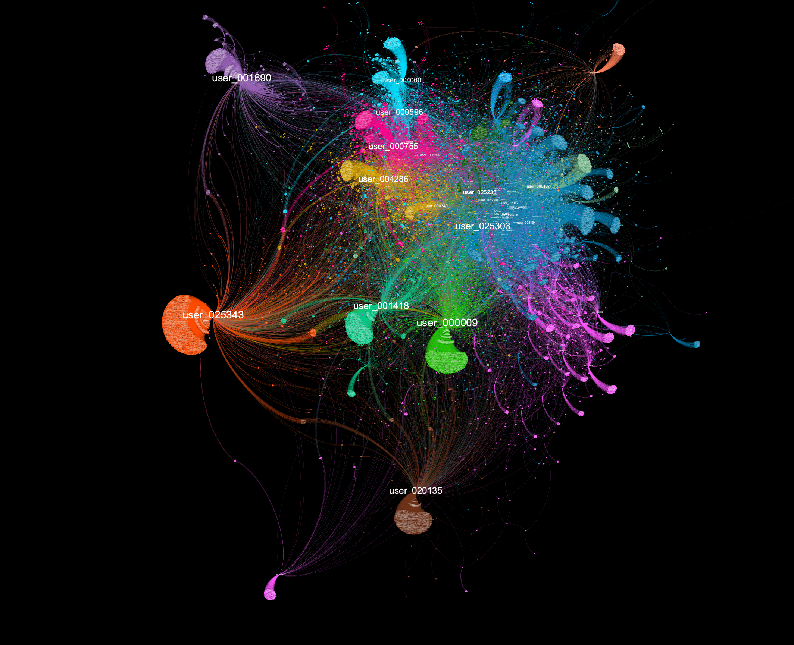


### UK2019 - UK2019/anonymized_interactions.csv
This dataset was collected using the filter function of Twitter's streaming API (https://developer.twitter.com/en/docs/twitter-api/v1/tweets/filter-realtime/api-reference/post-statuses-filter). The filter API was instructed to capture Tweet objects matching a small number of hashtags related to the December 12th 2019 UK general election. Hashtags included #GE2019, #GE19, #generalelection2019 and #generalelection19. The raw retweet interactions recorded by this process contained approximately 100,000 unique source nodes and 50,000 target nodes. This node-edge graph was too unwieldy to run experiments with, so it was trimmed as follows:
- targets that had received less than 5 retweets were dropped
- all but a random sample of 10,000 accounts that had exactly one outgoing retweet edge were dropped

The resulting dataset contains 112963 rows representing interactions between 35007 retweeters and 3057 retweeted across a total of 123890 retweet interactions. Some additional statistics about the dataset are generated in the accompanying notebook.

- **user_035060** was chosen as the high-profile account. This verified Twitter account belongs to a popular activist that receives engagement from left-wing users on the platform.
- **user_035067** was chosen as the target account. This non-verified Twitter account is a noteable proponent of Brexit, an avid supporter of the UK Conservative party, and often shares biased content and disinformation.

The following image is a graph visualization of this dataset.


Retweet interactions between accounts were processed from collected raw Tweet objects in the form:

**account_retweeting** - **account_being_retweeted** - **number_of_retweets_observed**. 

Account names were anonymized by replacing the Twitter user's screen_name with an anonymized name in the form **user_XXXXXX**. This data was then written to disk as a csv in the form Source,Target,Weight - allowing it to be read into Pandas dataframes and directly imported into gephi (https://gephi.org) for graph visualization purposes.

## Recommendation algorithm implementations
The fastai collaborative filtering model consists of a set of learned weight vectors for both sources and targets. A cosine similarity matrix can be built from each of these sets of vectors, thus allowing one to query the similarity between any given pair of sources or targets. Using these cosine similarity matrices, user-based and item-based recommendation logic can be implemented. The following sections describe our implementations which we consider the most obvious way to utilize similarity data. These implementations are thus likely to be popular in the real world.

### Target-based (item-based) similarity
Using the target-based cosine similarity matrix, recommendations can be calculated for a source based on who they've retweeted. For a given source, obtain a list of all target accounts they've retweeted and the number of times the source retweeted that account. For each of the target accounts identified, obtain a list of _t_max_matches_ most similar accounts from the (previously calculated) target-based cosine similarity matrix. For each of these, multiply the similarity value (between the source account and the target account) with the number of times the source retweeted the target account, and add that value to a running total score for each target retweeted account.

In pseudocode:
```
for target, num_retweets in get_source_retweets(source):
    for similar, similarity in get_most_similar(target):
        recommended[similar] += num_retweets * similarity
```

### Source-based (user-based) similarity
Using the source-based cosine similarity matrix, a ranked list of recommendations can be generated for a given source account as follows. First obtain a list of _s_max_matches_ accounts most similar to the source account. For each of these accounts, obtain a list of target accounts they retweeted, and the number of times they retweeted that account. For each target-retweeted_count pair, multiply retweeted_count by the similarity value between the source and this account. Add that value to a running total score for each target retweeted account.

In pseudocode:
```
for similar_source, similarity in get_most_similar(source):
    for target, num_retweets in get_source_retweets(similar_source):
        recommended[target] += similarity * num_retweets
```

Both of the above mechanisms will generate a ranked list of target accounts to recommend to a given source - a list of targets and score values where higher scores are more highly recommended. By comparing this ranked list to a list of accounts the source has already interacted with, a list of recommendations of targets the user hasn't yet interacted with can be generated.

The effectiveness of these methods can be determined by comparing the ranked list of recommended accounts against accounts the user has already retweeted. The more matches, the more accurate the recommendations are.

Here is a sample output for the target-based recommendation algorithm. "Retweeted by user" refers to the "Weight" value for that source-target pair in the raw dataset. "Total retweets" is a count of all retweets that the account received across the entire dataset. Note that the target-based recommendation algorithm only matched one account that the source had already interacted with (denoted by an asterisk).

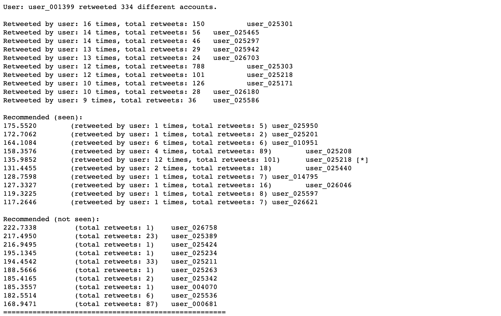

Here is a sample output for the source-based recommendation algorithm, based on the same user shown in the previous example. Nine of the calculated recommendations matched accounts the source had already interacted with.

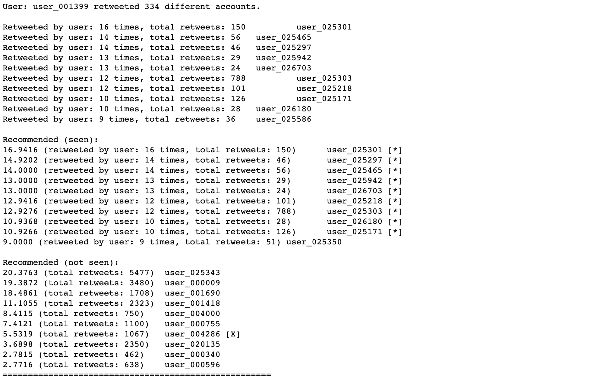

Based on experimental results it is apparent that the source-based recommendation method generated ranked lists containing many more accounts the user had already interacted with. This mechanism also recommended accounts with high engagement (number of retweets from all accounts).

The recommendation algorithms implemented in these experiments are intentionally simple. Social network recommendation mechanisms are likely based on similar principles (i.e. collaborative filtering, plus some additional logic), but may utilize other available information such as:
- accounts the user is following or being followed by
- metrics related to content a user viewed and how long they viewed that content for
- hashtags the user has included in their posts
- accounts the user has tagged in their posts
- accounts the user has replied to
- likes (which are not currently available via the Twitter API)
- the user's geographical region
- the user's language settings
- and so on.

It would be difficult to determine how close the algorithms implemented in this experiment match the underlying mechanisms used in real social networks such as Twitter. The data we're working with is fixed - a snapshot collected over a short period of time. The data also only includes interactions between a limited number of accounts. One may view this as a series of "what-if" experiments, which demonstrate how recommendations in the system would have changed if retweet activity differed from originally recorded behaviour.


# Results and discussion

## Experiment 1: Randomly chosen amplifiers

The following bar charts depict how injecting varying numbers of amplifier accounts and retweet counts into the dataset changed source-based recommendations in both the US2020 and UK2019 datasets. Each bar represents the mean percentage of control accounts that observed the target account in their top-3 source-based recomendations after poisoning had been applied, over 10 runs. Error bars indicate the minimum and maximum values across those ten runs.

The same value pair injection attack had no effect whatsoever on the target-based recommendation algorithm. This was the case across all of the conducted experiments. It is unclear why poisoning attacks had no effect on this recommendation methodology. However, it is worth noting that this observation demonstrates the fact that different recommendation approaches, even when based on the same model, can turn out to be more or less resilient to specific poisoning attack methodologies.


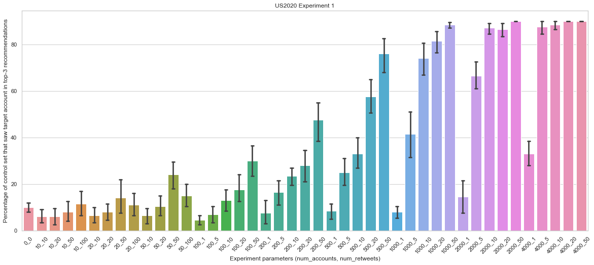
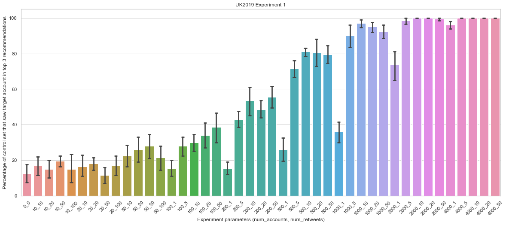

This experimental methodology was more effective at manipulating recommendations for the UK2019 dataset. This is noticeable at lower values (200 amplifiers with 50 retweets were required to obtain 50% coverage in the US2020 dataset versus 200 amplifiers and 10 retweets for the UK2019 dataset). At higher values, we observe that 1000 amplifiers with 1 retweet and 2000 amplifiers with 1 retweet were much more impactful on the UK2019 collaborative filtering models.

It is interesting to observe what happens to graph visualizations of these networks as we add edges. Here's the baseline UK2019 dataset with the target and high-profile accounts highlighted. Note the separation between the two accounts of interest.


Here's the same graph, but with 500 amplifiers, 1 retweet each. The target and high-profile nodes have moved closer together.


With 1000 amplifiers, 1 retweet each, the nodes move even closer together.


Note how close together the two nodes of interest are when we use 200 amplifiers, 20 retweets each.


This attack methodology becomes more effective at low numbers of amplifiers (100-500) when the number of retweets per account is increased. This is an interesting finding - individual attackers who don't have access to large numbers of fake accounts can perform a sufficiently effective attack by increasing the number of published retweets. The effectiveness of attacks involving higher numbers of accounts and lower retweet counts are especially revealing, since these are exactly the sorts of actions that are orchestrated by communities on Twitter, especially when sharing disinformation.

Since the US2020 dataset was created by following specific Twitter accounts, it is representative of the sort feed Twitter's own algorithms would need to process in order to deliver that user a curated timeline. Twitter's curated timeline is the default display option for a user's home timeline, and thus if it were to use a retweet similarity algorithm similar to the one implemented in these experiments, it would be susceptible to such manipulation. Twitter has openly stated that they factor "Likes" into building timelines, so it may be possible that a similar mechanism to the one documented here using the "Like" button instead of the "Retweet" button may be effective at surfacing content on the control users' timelines. This method may also be relevant if Twitter's follower recommendations are based on accounts they most often interact with (although that is not likely to be the case).

## Experiment 2: Amplifiers chosen based on community

The following bar charts depict experimental results from selecting amplifiers based on Louvain community detection applied to a node-edge graph of the baseline datasets, and using fixed parameters (200 amplifiers with 20 retweets per account). Note that only communities with at least 200 members were used in these experiments. Community label is marked on the x axis.

Here's the bar chart for the US2020 dataset. Bear in mind that using randomly chosen amplifiers resulted in about 30% of the control set being recommended the target account with the selected parameters.
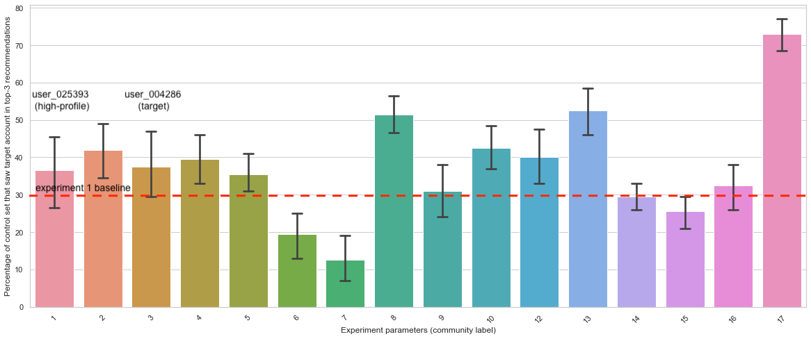

Here we can see that community had significant effects on the resulting recommendations. Communities 6 and 7 saw a marked reduction in effectiveness of the attack as compared to using randomly selected amplifiers. Communities 8, 13 and 17 worked significantly better than the baseline. Note that assigning amplifier accounts from communities 1 and 3 (the communities that the high-profile and target accounts belonged to) had very little impact on the effectiveness of the attack.

Here's the bar chart for the UK2019 dataset. Bear in mind that using randomly chosen amplifiers resulted in about 50% of the control set being recommended the target account.
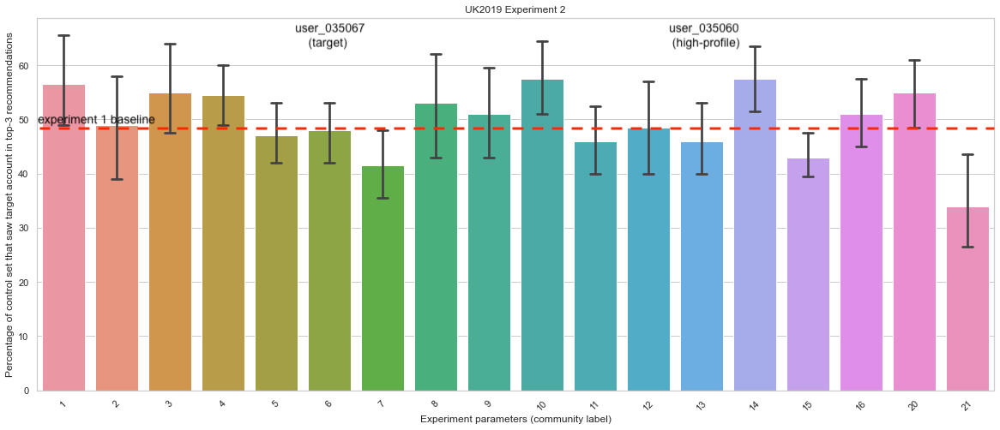

Community membership had much less effect on recommendation outcomes in the UK2019 case.

This is an interesting result. I would have assumed that conducting an attack using accounts that behave in a similar way to the target or high-profile account would be more effective. That didn't turn out to be the case. The fact that community membership had a significant effect in one dataset and not in another leads me to believe that network structure plays a role in the effectiveness of these attack mechanisms in general. It would be interesting to capture more datasets in order to determine what graph structural features impede or assist these attack mechanisms.

In order to attempt to determine why certain communities had a more pronounced effect on the poisoning attack, a number of features were extracted from the communities identified by Louvain community detection for the US2020 dataset. The features are shown below.

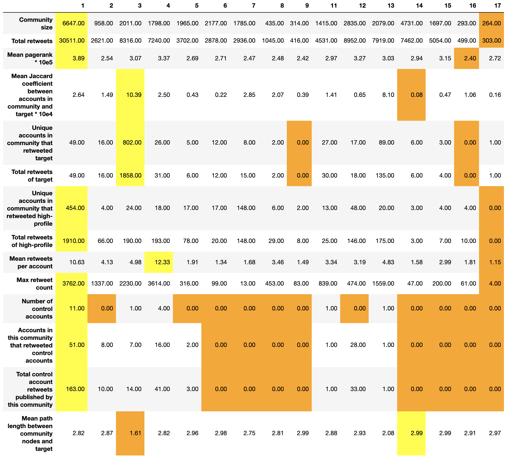

None of the features extracted seem to correlate with either the reduced effectiveness (6 and 7) or increased effectiveness (8, 13 and 17) attacks. Communities 8 and 17 are both fairly small (435 and 264 members respectively), but other communities of comparable size exist (9 and 16) that didn't exhibit increased attack effectiveness. Community 13, which also showed increased effectiveness, was quite large (2079 members). Communities 8 and 17 both contained a very small number of accounts that interacted with the chosen target and high-profile accounts, but so did a few others (14, 15 and 16). In contrast, community 13, which saw increased attack effectiveness had a significant number of members that interacted with both the target and high-profile accounts. Considering community size, total retweets, and mean retweet count, communities 9 and 17 are very similar, and yet showed significant differences in attack effectiveness. Community 17 stands out as having by far the lowest maximum retweet count (meaning the most active account in that community only published 4 retweets - the next lowest value was 13 from community 7). Communities 1, 3, 4, 11 and 13 contained nodes from the control group, and yet exhibited different behaviours when members were selected for the attack. Graph analysis metrics such as mean pagerank value of nodes in the comunity, mean Jaccard distance between nodes in the community and the target node, and mean path length between nodes in the community and the target node do not show any consistent patterns across the more and less effective poisoining attacks.

## Experiment 3: Amplifiers chosen based on similarity to control accounts

The following bar charts depict experimental results where amplifiers with high similarity to the twenty control accounts were selected. Similarity values were obtained from the source-based similarity matrix calculated for the baseline dataset in each case. A range of amplifier count - retweet count parameters were tried.

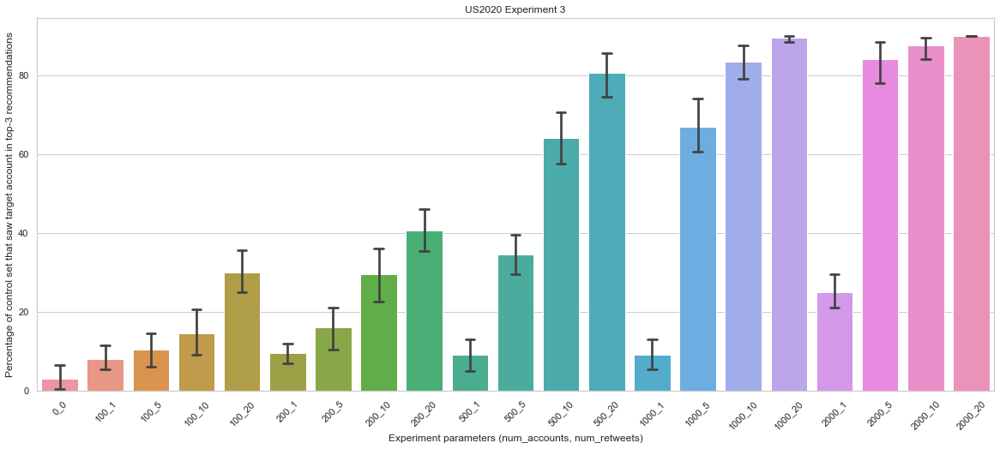

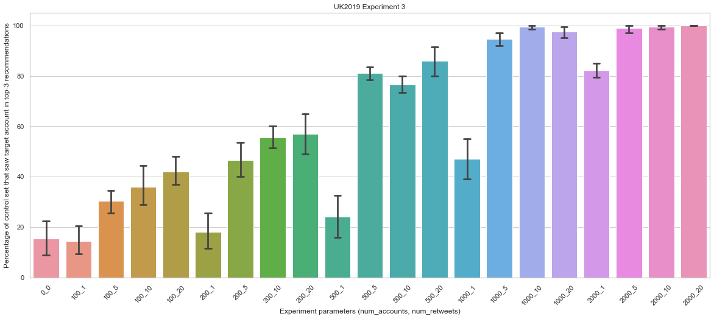

Generally speaking, choosing accounts similar to the control set imparted a roughly 10% increase in the effectiveness of baseline attacks that achieved 60% or less coverage (as compared to randomly selected accounts). Since more aggressive attacks (those that utilized 1000 or more amplifiers) were already nearing full coverage, choosing amplifiers similar to the control in this case set had no noticeable effect.

This result is interesting when considering a social engineering attack scenario. An attacker who wishes to specifically target an individual can instruct fake accounts to behave the same way as the victim account - i.e. have those fake accounts spend a few days retweeting the same content as the victim account prior to launching the actual attack. Since social network recommendations are likely only calculated across a recent slice of activity, it should be easy for an attacker to sync their fake accounts with the victim's account in this way.


# Conclusions

The experiments detailed in this report illustrate that Sybil attacks against the described recommendation mechanisms are fairly easily to carry out. Even using relatively low numbers of amplifiers and retweet counts, it is possible to significantly alter both network structure and collaborative filtering models. The attacks detailed in this report bear a likeness to tactics already used on Twitter to spread disinformation and amplify political content. As such, it it possible that the coordinated groups of accounts participating in these attacks are already successfully altering Twitter's underlying recommendation mechanisms. The people involved in followback rings likely aren't considering Twitter's algorithms when they amplify content. Instead they've unconsciously discovered behavioural patterns that enable them to get their content and messages out (albeit mostly to others within their own filter bubble). If these groups were capable of running their own experiments to probe Twitter's recommendation mechanisms, they could, in theory, adopt different patterns of behaviour that would allow them to spread disinformation to the wider Twittersphere.

Detecting the mechanisms behind these attacks would likely be difficult, and may differ based on which attacks are conducted. Attacks involving large numbers of amplifiers all publishing a single, or small number of retweets are similar in nature to organic mechanisms such as tweets going viral (a user posts a tweet that resonates with people, and that tweet receives many retweets despite that user not normally receiving high levels of engagement). Some circles on Twitter consist of two types of accounts - "influencers" who mainly post original content, and "consumers" who don't usually post their own content but instead read and retweet content from others. In these circles, tweets that "influencers" publish usually receive hundreds or even thousands of retweets largely from the same group of "consumer" accounts. Because of the fact that much of Twitter's organic activity follows these mechanisms, identifying users that always retweet content from certain accounts is not a viable strategy for finding coordinated behaviour. Tweets with "retweet this" are, of course, a signal that the publisher of the tweet wants it to be amplified, but tweets containing that phrase are rather common on Twitter, and don't necessarily reflect true coordination (some of which is likely organized on platforms outside of Twitter).

Attacks that utilize larger numbers of retweets per account may have an effect on retweet count frequency distributions (the distribution of the number of accounts that published n retweets). For example, here's the retweet count distribution for the baseline UK2019 dataset (logarithmic y-scale):

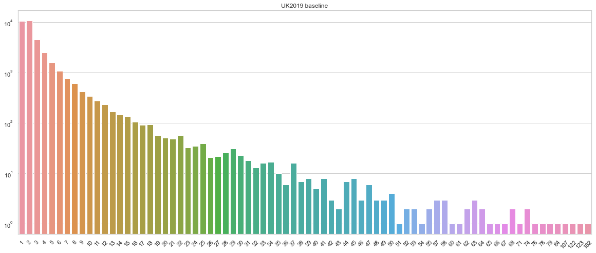

Compare this to the retweet distribution for the dataset where 200 accounts each performed 20 retweets of both target and high-profile accounts.

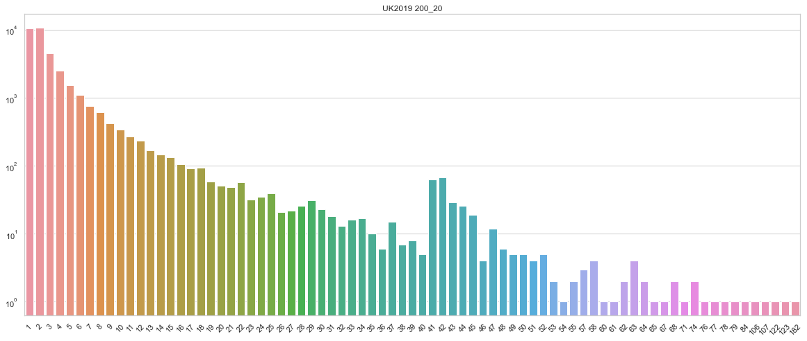

Detection methods that compare retweet count distributions would be able to identify such attacks. Such detection mechanisms could be paired with logic to obtain a list of accounts that participated in the attack (since they would clearly stand out). However, for single-retweet attacks, retweet count distributions are largely unaffected. Here's the baseline UK2019 distribution using a linear scale.

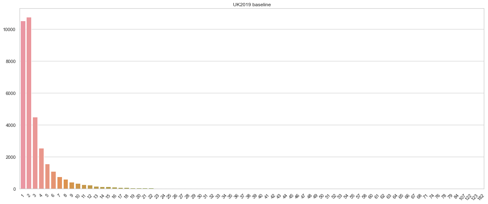

Here's the distribution of the same dataset, but poisoned with 1000 amplifiers, one retweet each.

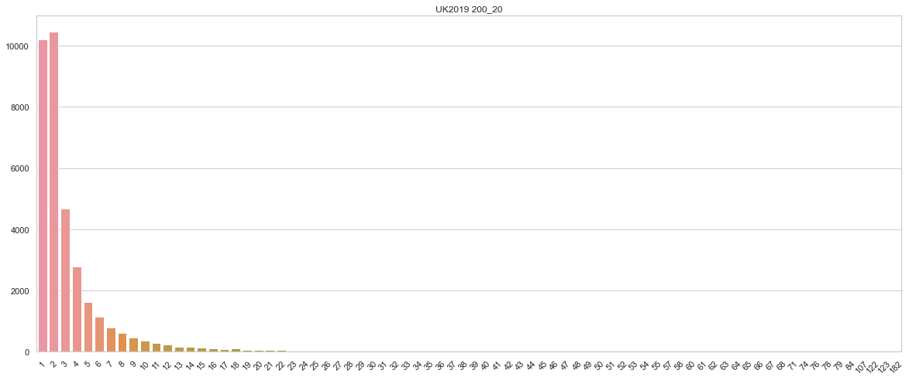

Another potential method for detecting the promotion attacks described here would be to measure similarities or graph-based distances between influencer accounts in a series of timeslices. If a distance or similarity value changes significantly between two slices, it may be the indication of a promotion attack. Unfortunately, similarity values and graph-based metric calculations were not observed to be fully deterministic in these experiments, so using those values may be problematic. However, this is a topic worth looking into.

# Future directions
These experiments used the dot bias model available in fastai. The library also contains a neural network-based collaborative filtering model, with adjustable neural network layer parameters. The code that implements the neural network-based model can be found in the accompanying notebooks. Although I didn't run the full suite of tests using the nn-based model, I did run a few experiments and the output of those models looked very similar to that of the dot bias model. Other collaborative filtering mechanisms exist, so perhaps it is worth trying some others, especially more recent methodologies, to compare the output.

The recommendation logic implemented in these experiments was intentially designed to be as simple as possible. However, it might be worth implementing more complex logic that utilizes multiple models that are based on other information available from Twitter (such as user-hashtag, user-mention, and user-reply interaction maps). More complex recommendation logic would likely be more robust to the simple attacks detailed here.

Given differences in the effectiveness of attacks between the two studied datasets where participating nodes were chosen from specific communities, it might be interesting to run these experiments on additional datasets in order to understand why this was the case. In fact it would be interesting to study in more detail how graph structural features effect these attacks. It would also be useful to observe how a graph's structure and features change as edges are added between different groups of nodes.

An interesting line of research would be to develop a more deterministic and optimized approach to conducting attacks. This would involve developing methodology to select accounts and parameter values by optimizing a cost function based on the success of the attack. By developing such a methodology, it would be possible to determine which kinds of accounts are better used to perform these attacks, and what minimum parameter values are required for specific success criteria. This, in turn, would allow us to idenfity which accounts are particularly influential ("dangerous") and label them accordingly.

One possible future direction would be to look into developing a detection technique to identify followback rings and the types of posts they would likely try to promote. If such a mechanism were to be developed, it could be used to mitigate the influence followback are able to exert on social networks, and mitigate such attacks.

Finally, a study into developing detection and defense mechanisms against the attacks decribed in this report is an obvious future direction.


# Contribution

While researching this topic, I found many github repositories implementing fastai's collab functions, but almost all of them were copy-pasted from the tutorial on fastai's site. The notebooks in this repository contain fully coded and documented examples of how to use fastai's collab library to perform collaborative filtering and recommendation mechanisms, which I hope will be of interest to the community. The experiments described here utilize real-world Twitter data, as opposed to the movielens or goodbooks datasets that were used in all other code examples I could find. I have made these datasets publicly available in hopes that they may be used in future research. This github repository contains well-documented steps (and code) that illustrate a number of interesting attacks against collaborative filtering models and recommendation mechanisms. These attacks can be mapped to real-world Twitter usage. Finally, this report contains a number of suggestions for directions to take this research in.

# Appendix

## Libraries used

- Numpy (https://numpy.org/)
- Pandas (https://pandas.pydata.org/)
- NetworkX (https://networkx.org/)
- Louvian community detection (https://github.com/taynaud/python-louvain)
- Collaborative filtering model: fastai collab_learner (https://docs.fast.ai/collab)
- Cosine similarity matrix: sklearn cosine_similarity (https://scikit-learn.org/stable/modules/generated/sklearn.metrics.pairwise.cosine_similarity.html)
- Visualizsation: matplotlib (https://matplotlib.org/) and seaborn (https://seaborn.pydata.org/)

## Additional graph visualizations

The US2020 dataset with target and high-profile nodes highlighted.

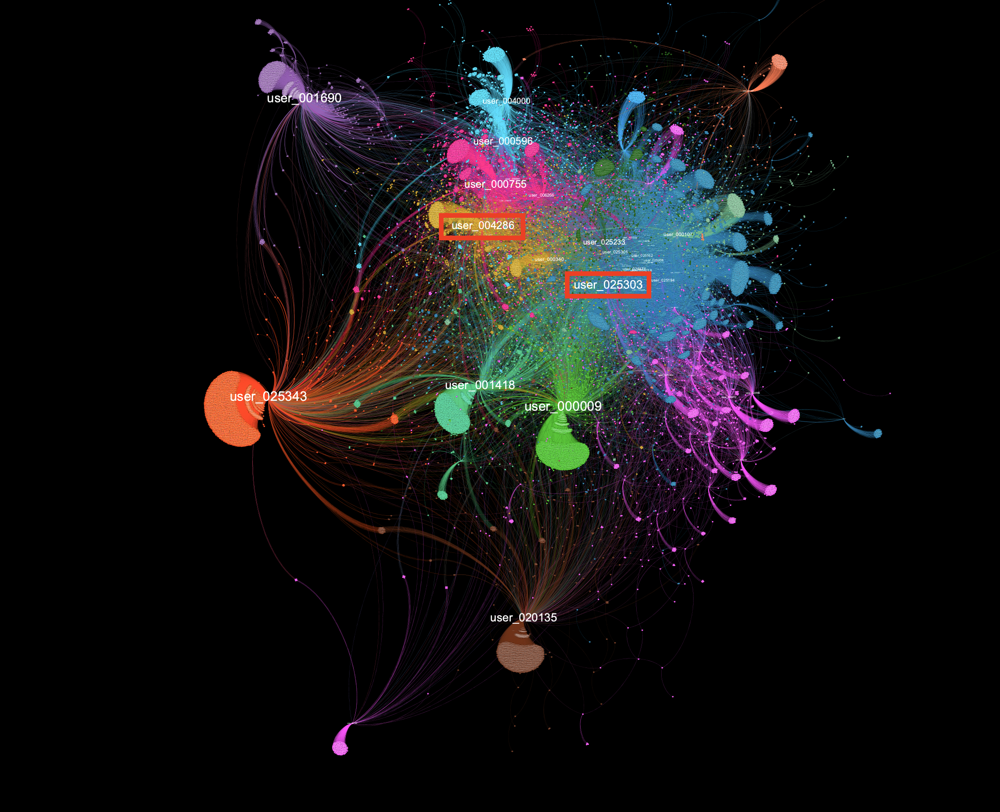

The US2020 dataset with 200 nodes performing one retweet each of both target and high-profile accounts.

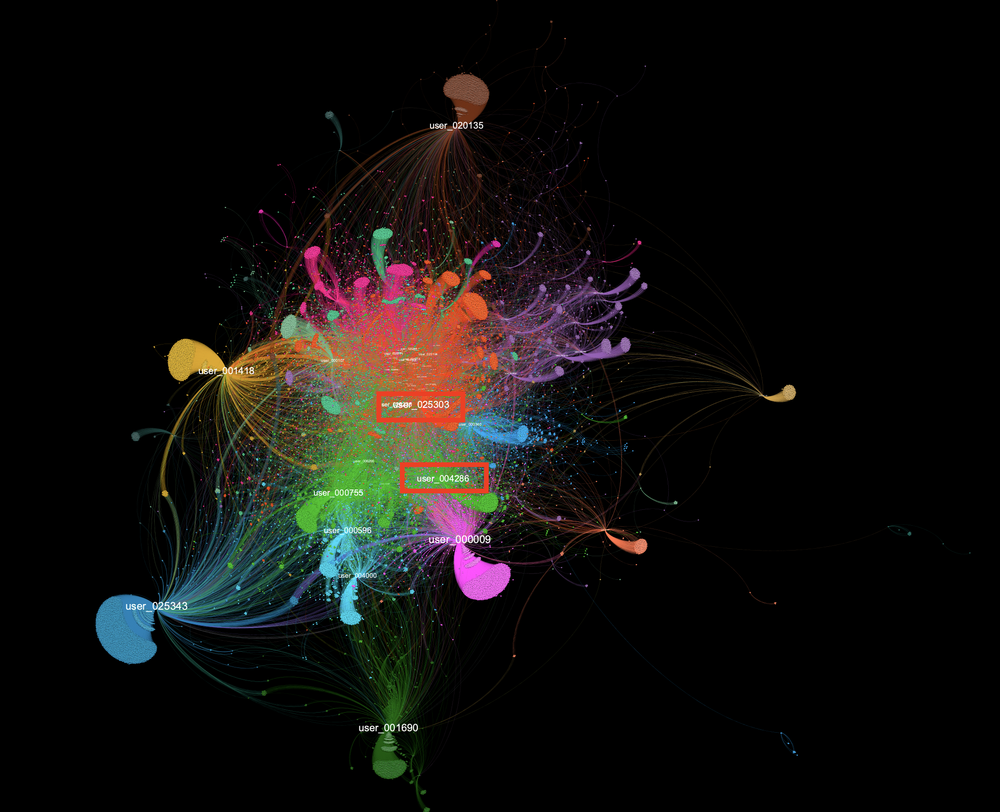

The US2020 dataset with 200 nodes performing 20 retweets each of both target and high-profile accounts.

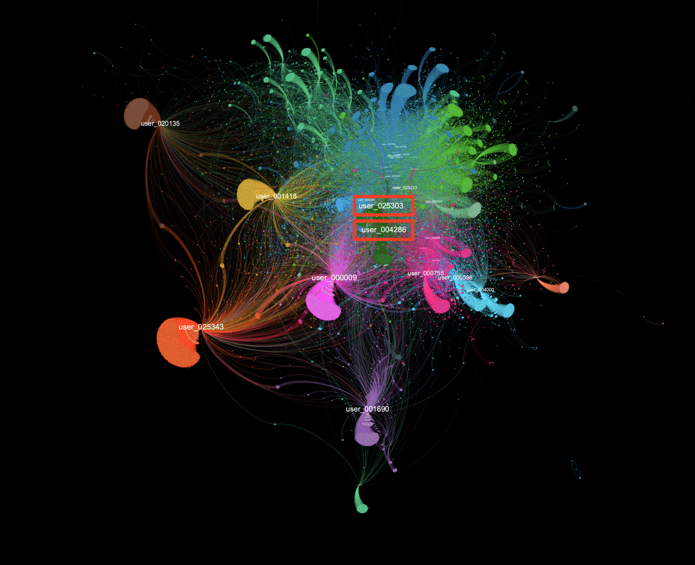

The US2020 dataset with 500 nodes performing one retweet each of both target and high-profile accounts.

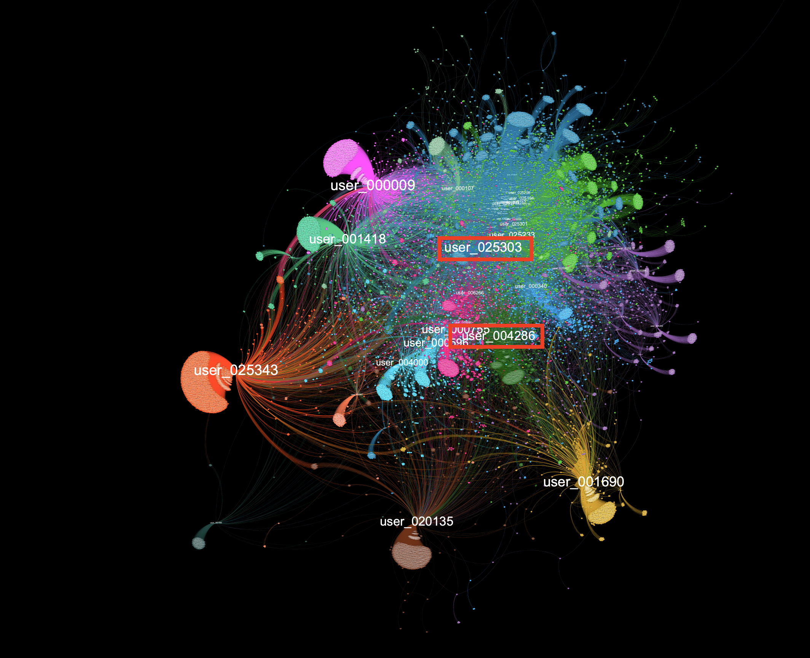

The US2020 dataset with 500 nodes performing 5 retweets each of both target and high-profile accounts.

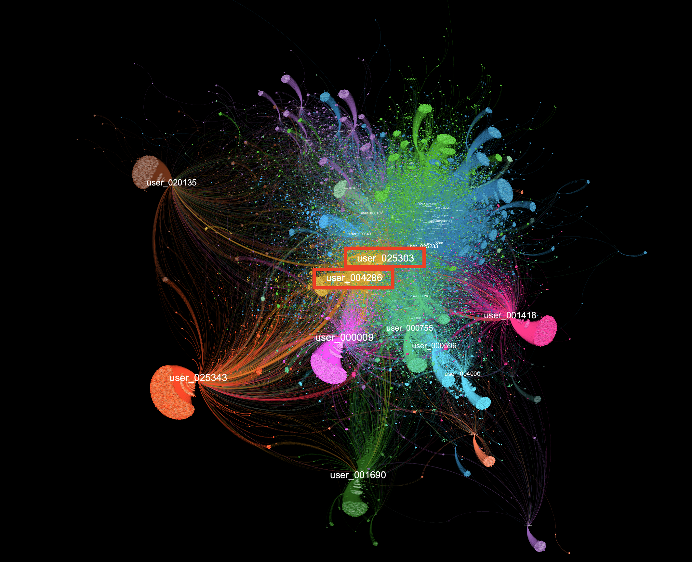

The US2020 dataset with 1000 nodes performing one retweet each of both target and high-profile accounts.


The US2020 dataset with 2000 nodes performing 5 retweets each of both target and high-profile accounts.

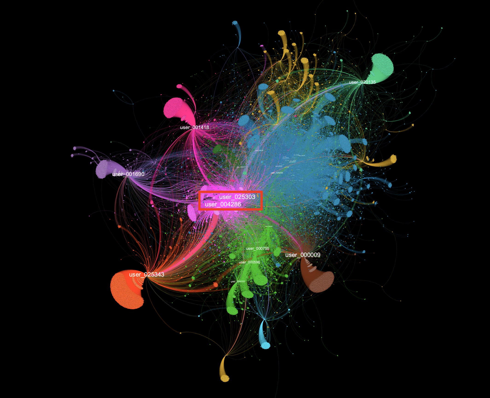


